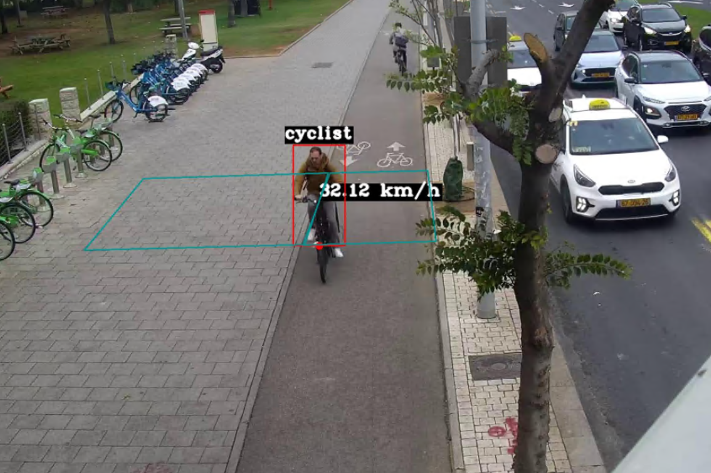
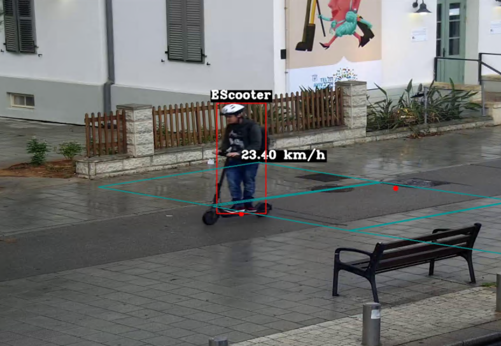
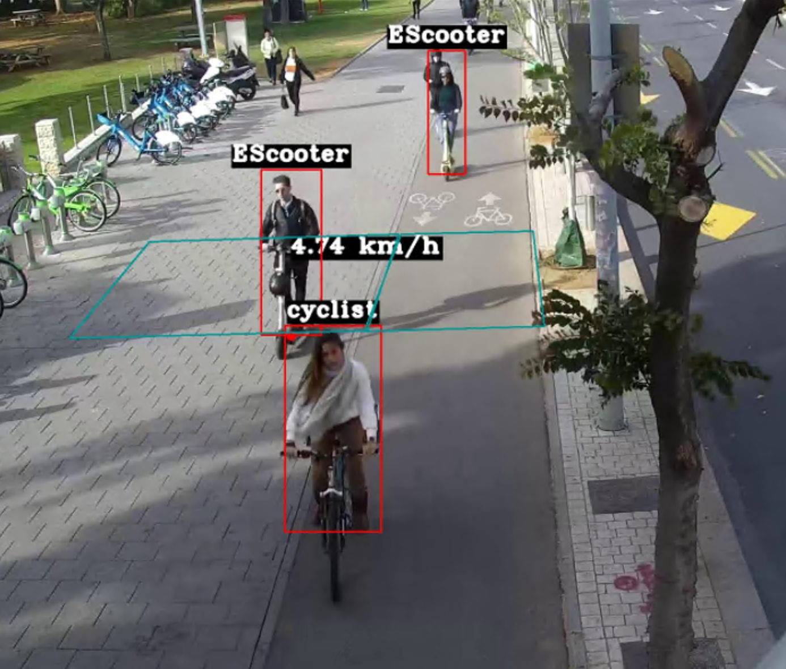

# Personal Mobility Device (PMD) Classifier
Built and maintained a PMD classifier from scratch (i.e at the beginning with zero data) - Preprocessed CCTV footages, implemented autolabeller to obtain persons from the footages, trained model on preprocessed images

# Results
This process took around 3 months for the classifier to accurately classify riders in the CCTV with 98% accuracy for each class.

