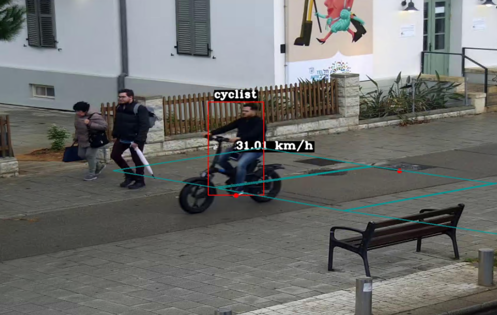
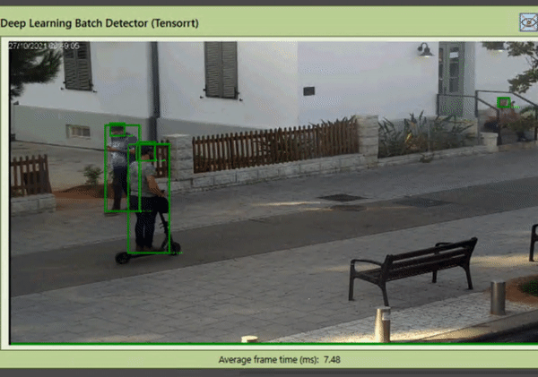

# Machine Learning Engineer Internship
 Written preprocessing, data augmentation and training scripts during my internship that were heavily responsible for the implementation of models in the business-level deployment.
 
# My Internship Role
 My main responsibility is to develop and maintain ML models to perform specific tasks in challenging uncontrolled environments in the field of security, safety and operations.
 
# Achievements
 1. Developed a [Personal Mobility Device (PMD) classifier](PMD_Classifier) that was implemented in several CCTVs in Tel-Aviv City, Israel, achieving a 98% accuracy during our latest inference.

 

  
 

 2. Solved an overfitting issue regarding our proprietary [YOLOv4 detector](YOLOv4) that could only detect standing persons and not fallen persons by implementing data augmentation using persons from the same distribution, resulting in fall detection test to pass during inference.
 
 

  
 

 3. Developed a new Face Attribute Recognition by combining multiple CNN architectures to create a multi-output classifier, successfully predicting attributes such as Maskwear, Hair Colour, Hair Length, Facial Hair, Age, Gender.
