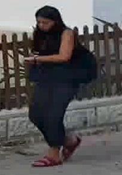
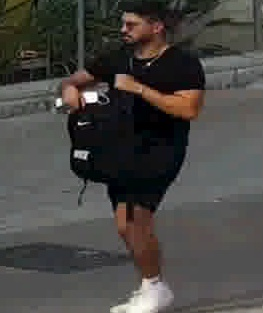
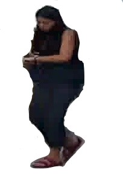
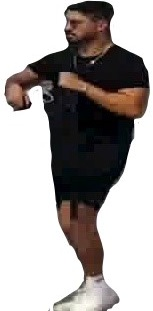
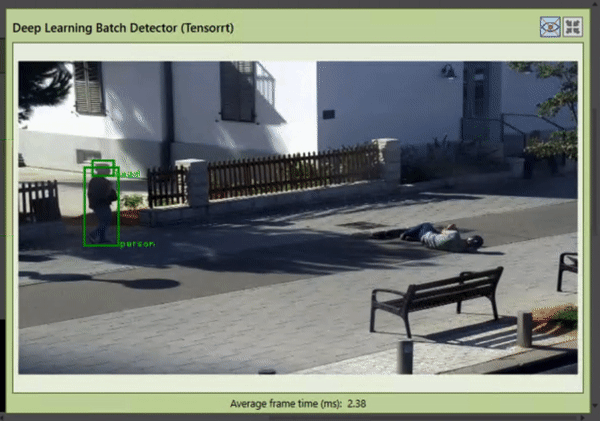
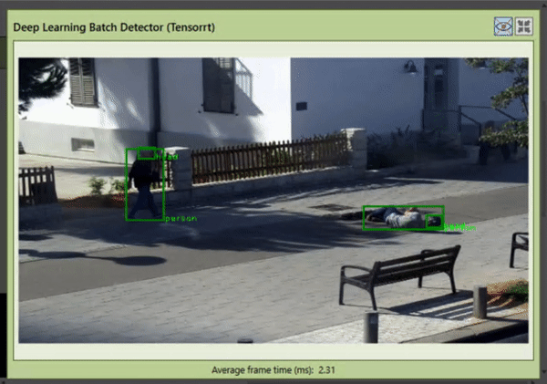

# YOLOv4 Detector
  Successfully trained detector to detect fallen person and removed several false positives (such as strollers being detected as persons) by data augmentation
  
# Fallen Person Detection
  The biggest problem with regards to fallen person augmentation was the 'head' class inside our detector which no contouring could successfully create a bounding box around the head of a person during augmentation.
  
  This problem is resolved using bounding box augmentation where I've implemented a rotation matrix to augment the bounding box of a pre-labelled person.
  
  ## Data Augmentation
  Initially, we have existing pedestrians from existing datase which I then manually painted their backgrounds white using Paint 3D.
  
  ### Original Images
  
   
  
  ### Augmented Images
  
   
  
  
  After augmenting enough pedestrians, I collected existing CCTV frames of backgrounds and placed the pedestrians in the frame to mimick a fallen person.
  
  ### Background frame with no pedestrians
  
  
  
  ### Background frame with augmented pedestrian
  
  
  
  # Results
  After training the detector with the added augmented frames, it successfully detected fallen pedestrians, including random online stock videos of people falling.
  
  ### Before training
  
  
  ### After training
  
  
